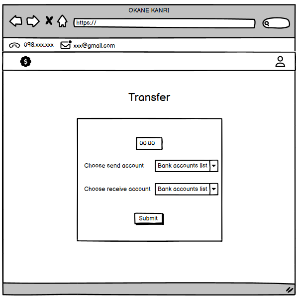

**TABLE OF CONTENTS**

1. Project Introduction	
   1. Project information	
   2. Project team	
   3. Purpose of Project	
   4. System users	
2. System Function
   
   1.List of feature  
   2. Screen detail	 
   3. Wireframe	

3. Site Map
4. Database Design  1.Entity Relationship Diagram
   
   2.Database Diagram
   
   3.Attributes table
   
5. Systems Design
6. Conclusion

I. **Project Introduction**

   1. **Project information**

   Name system: OKANE KANRI - EXPENSE MANAGEMENT

   2. **Project team**

   NHÓM 8 - SE1860

   STT 34: Võ Ngọc Bảo Thư - SE183213 

   STT 35: Vũ Giang Nam - SE183966    

   3. **Purpose of Project**

   The purpose of a web-based expense management system is to simplify, automate, and monitor the processes involved in managing and controlling expenses. These systems aim to streamline the often complex and time-consuming task of logging spending activity. This is achieved by storing expense information and categorizing it into separate categories. At the same time, these systems provide tools for analyzing spending patterns. Their functionality typically includes expense reporting and tracking, storing wallet account balance information, and viewing expense/funding history. Overall, these systems help create an effective expense savings plan.

   4. **System users**

   ● Regular User:  they are registered users who are actual customers or potential customers.

   ● Admin: the organization, acts as the system administrator.

II. **System Function**

   
   1. **List of feature**

 **1. User profile:**

1\.1. The system allow users to create a personal account with a unique email and password.

1\.2. The system allow users to log into their account using their email and password credentials.

1\.3. Users can update their profile details such as username, email, and password.

**2.Expense Tracking** 

2\.1. The screen page display total balance and total expense across all user's accounts.

2\.2. Allow users to record an expense by entering details such as amount, date, description, category and payment account.

2\.3. The expense tracking display can sort expenses transaction history into customizable categories defined by the user following by category, account,date.

2\.4. The system shall allow users to edit and delete previously saved expense transactions.

**3.Wallet and Budgeting**

3\.1. The system display total balance and expense across all user's accounts.

3\.2. Allow the user to transfer money between different accounts owned by the user.

3\.3. The system allow users to deposit funds into accounts which will update the account balance.

3\.4. User can creates new cash accounts, bank accounts, e-wallet accounts and other accounts for contain money.

**4.Report**

4\.1 The system shall allow users to view expense and budget reports by custom month/year ranges by charts.

4\.2 User can view total expense in each categories by money an percent by list and pie chart.

 2. **Screen details**

|#|Feature|Screen|Description|
| :-: | :-: | :-: | :-: |
|1|Common|Homepage|Introduction|
|2|Common|User login|User sign-in to the system|
|3|Common|User Register|Create a new account|
|4|Main feature|User profile|
User change their information

User change the password
|
|5|Main feature|Wallets|Note details of money(total balance/expense, balance in each account), view funding history|
|6|Main feature|Fund addition|Making a deposit|
|8|Main feature|Add account|create account to contain money|
|7|Main feature|Track expenses|Showing expense history|
|8|Main feature|Expenses detail|View expense information|
|9|Main feature|Withdrawal|Disbursing funds from the account|
|10|Main feature|Transfer|Transfer money between accounts|
|10|Main feature|Intuitive graph|Displaying expense analysis charts, count total expense in each categories|
|11|Common|Contact|Note the information of the organization|

 

   3. **Wireframe**

   **Homepage**

- Function trigger: User clicks on link of the website.
- Function description: User can view all homepage.

   Screen Layout: 

- Function details:
- "LOGIN": Button that directs existing users to a login page where they can enter their credentials.
- "SIGN UP": Button for new users to create an account with Okane Kanri.
- "SIGN UP NOW": A prominent call-to-action button that likely leads new users to the registration process.
- "TO TRACK", "TO VIEW", "REPORT": These labels probably describe the three core functionalities of the service:

**Login  & Sign up**

- Function trigger: This use case starts when the user clicks to "Log In"/”Sign up” button on the navigation bar.
- Function description: User sign-in to the system.
- Function details:
- Log in: Require user input email, password. If it’s a match ⇒ login successfully.
- Sign up: Require user input email, password. Check if the account exists, if no ⇒ create an account successfully.

**Profile**

- Function trigger: This use case starts when the user clicks to profile icon on the navigation bar.
- Function description: Show user’s profile detail.
- Function details: User can click on email/password to change it, it will redirect to the corresponding site. Check if email/password match ⇒ change.

**Expenses screen**

- Function trigger: This use case starts when the user clicks to "Expenses” button on the navigation bar.
- Function description: Show expenses list, total expenses, balance.
- Function details:
- Sort by: User can choose multiple types to sort by Date, Category, Account .

**View detail**

- Function trigger: This use case starts when the user clicks on an expense.
- Function description: Detail of that expense.

**Add new expense**

- Function trigger: This use case starts when the user clicks on “+" button.
- Function description: Add new expense.
- Function detail: Require user input Amount, Name, Time, Account, Category, Note of that expense. Then the user clicks on the Add button and that expense will be added to the wallet.

**Wallets**		

- Function trigger: User clicks on the wallet button on the home bar.
- Function description: 
- User can view wallet screen details.
- This screen shows the total balance the user has in all accounts in the wallet and the expense the user has made.
- also view four buttons representing cash account, bank account, E-wallet account, or other types of account.
- Function Details:
- If the user wants to view the list of accounts maintained in each accounts session(cash, bank, e-wallet, other), user will click on the corresponding button.
- Else, if the user wants to add funds to an account, the user will click on the “Add funds” link in each button, and to add an account click on the” Add accounts” link.
- When creating an account cash account automatically have an empty account.
- In row show type icon, name account, Bank name(bank account type)/AppName(e-wallet account type), note, balance in account and action whether to edit the account information or delete the account.

**Add account screen**

- Function trigger: User clicks on the “Add account” link on the corresponding button and screen pop-up the small screen.
- Function description: Create a new account for storing money user has.

- Function Details:

- User adds the name of the new account, chooses the bank or app name of the e-wallet(for bank account and e-wallet account), and “Note” for take note user wants to add.
- Click submit to create a new account successfully

**Add fund to account screen**

- Function trigger: User clicks on the “Add funds” link on the corresponding button
- Function description: Add an amount of money into an account

- Function Details:

- User enters the amount of money, then choose account in the accounts list according to separate account type.
- Submit to add the money successfully

**Edit account information**

- Function trigger: User clicks on the “edit” link on the account line.
- Function description: User changes the account data.

- Function Details:
- The user edit the balance amount, enter the name of the account, Bank name(for bank account)/e-wallet provider(for e-wallet account), Notes and submits. 
- All old details will be replaced with the data user types and submit in the edit account screen.

**Transfer between accounts**

- Function trigger: User clicks on the “Transfer” button on the wallet screen(pop up).
- Function description: User transfers money from this account to other account.

	

- Function Details:
- The user enters the amount of money user want to transfer out of the chosen account.
- choose received account to earn that transferred money.
- Submit to transfer successfully.

**Intuitive graph**						

- Function trigger: User clicks on the

“Dashboard” button on the home bar.

- Function description: The user views the analysis chart of expenses through months of a year.
- Function Details:
- The user will select a month of a year and the screen will represent the chart analysis of spending months in the year that user chooses.
- Below, user can view the pie chart statistic categories used in that month.
- End screen shows the summary, and total of expenses in each category.

**Contact**

- Function trigger: User click on “Contact” button on the home bar.
- Function description: User view the information of the organization.

III. **Site Map**

IV. **Database Design**

  1.***Entity Relationship Diagram***
  

  2.***Database Diagram***

  

  3.***Attributes table***
  ###
### ***Table Descriptions***

|**No**|**Table**|**Description**|
| :- | :- | :- |
|01|User|Describe information about users of the system.|
|02|Wallet|This table lists different types of wallets available in the system, such as physical wallets, electronic wallets, etc. Each wallet type is uniquely identified.|
|03|Bank|Lists different types of wallets available in the system, such as physical wallets, electronic wallets, etc. Each wallet type is uniquely identified.|
|04|EWallet|This table provides a list of banks integrated or recognized in the system. Each bank has a unique identifier and a name.|
|05|ExpenseCategory|Describe categories in each expense transaction.|
|06|Account|Describe details about various accounts held by the users. It includes information on the account type, associated user, balance, and links to specific banks or e-wallets, where applicable.|
|07|Transaction|Records detailed information about financial transactions made by users. It captures various aspects of each transaction, including its type (income or expense), amount, date, and related notes, and links these to specific user accounts and categories.|
|08|Transfer|Show details of a transfer transaction amount between accounts of the user.|

### ***Attribute Data Dictionary***

<table><tr><th valign="top"><b>Entity Name</b></th><th valign="top"><b>Attributes</b></th><th valign="top"><b>Description</b></th><th valign="top"><b>Domain</b></th><th valign="top"><b>Null</b></th></tr>
<tr><td rowspan="6" valign="top">User</td><td valign="top">User ID (PK)</td><td valign="top">` `Unique identifier of the user </td><td valign="top">int</td><td valign="top">No</td></tr>
<tr><td valign="top">Username </td><td valign="top">Unique identifier of the user </td><td valign="top">Nvarchar(255)</td><td valign="top">No</td></tr>
<tr><td valign="top">Email </td><td valign="top">Registered email</td><td valign="top">Nvarchar(255)</td><td valign="top">No</td></tr>
<tr><td valign="top">Password </td><td valign="top">Account’s password</td><td valign="top">Nvarchar(255)</td><td valign="top">No</td></tr>
<tr><td valign="top">Balance</td><td valign="top">Current balance of the user </td><td valign="top">decimal(10, 2)</td><td valign="top">No</td></tr>
<tr><td valign="top">Expense amount</td><td valign="top">Amount of expenses</td><td valign="top">decimal(10, 2)</td><td valign="top">No</td></tr>
<tr><td rowspan="2" valign="top">Expense Category</td><td valign="top">Category ID (PK)</td><td valign="top">Unique identifier of the category</td><td valign="top">int</td><td valign="top">No</td></tr>
<tr><td valign="top">Name</td><td valign="top">Name of the expense category </td><td valign="top">Nvarchar(255)</td><td valign="top">No</td></tr>
<tr><td rowspan="2" valign="top">Wallet</td><td valign="top">WalletTypeID (PK)</td><td valign="top">Unique identifier of wallet type</td><td valign="top">int</td><td valign="top">No</td></tr>
<tr><td valign="top">TypeName</td><td valign="top">Name of the wallet type</td><td valign="top">Nvarchar(255) </td><td valign="top">No</td></tr>
<tr><td rowspan="2" valign="top">Bank</td><td valign="top">BankID (PK)</td><td valign="top">Unique identifier of the bank</td><td valign="top">int</td><td valign="top">No</td></tr>
<tr><td valign="top">BankName</td><td valign="top">Name of the bank</td><td valign="top">Nvarchar(255) </td><td valign="top">No</td></tr>
<tr><td rowspan="2" valign="top">E-wallet</td><td valign="top">EWalletID (PK)</td><td valign="top">Unique identifier of the e-wallet</td><td valign="top">int</td><td valign="top">No</td></tr>
<tr><td valign="top">EWalletName</td><td valign="top">Name of the e-wallet app</td><td valign="top">Nvarchar(255) </td><td valign="top">No</td></tr>
<tr><td rowspan="8" valign="top">Account</td><td valign="top">AccountID (PK)</td><td valign="top">Unique identifier of the account</td><td valign="top">int</td><td valign="top">No</td></tr>
<tr><td valign="top">AccountName </td><td valign="top">Name of the account</td><td valign="top">Nvarchar(255)</td><td valign="top">No</td></tr>
<tr><td valign="top">WalletTypeID (FK)</td><td valign="top">Foreign key referencing Wallet</td><td valign="top">int</td><td valign="top">No</td></tr>
<tr><td valign="top">UserID (FK)</td><td valign="top">Foreign key referencing User  </td><td valign="top">int</td><td valign="top">No</td></tr>
<tr><td valign="top">BankID (FK)</td><td valign="top">Foreign key referencing Bank</td><td valign="top">int</td><td valign="top">Yes</td></tr>
<tr><td valign="top">EWalletID (FK) </td><td valign="top">E-Wallet ID associated with account</td><td valign="top">int</td><td valign="top">Yes</td></tr>
<tr><td valign="top">Note</td><td valign="top">Additional notes for the account</td><td valign="top">Nvarchar(100)</td><td valign="top">Yes</td></tr>
<tr><td valign="top">Balance</td><td valign="top">Balance of the account </td><td valign="top">decimal(10, 2)</td><td valign="top">No</td></tr>
<tr><td rowspan="9" valign="top">Transaction</td><td valign="top">TransactionID (PK)</td><td valign="top">Unique identifier of the transaction</td><td valign="top">int</td><td valign="top">No</td></tr>
<tr><td valign="top">UserID (FK)</td><td valign="top">Foreign key referencing User</td><td valign="top">int</td><td valign="top">No</td></tr>
<tr><td valign="top">AccountID (FK)</td><td valign="top">Account associated with transaction</td><td valign="top">int</td><td valign="top">No</td></tr>
<tr><td valign="top">CategoryID (FK)</td><td valign="top">Category associated with transaction</td><td valign="top">int</td><td valign="top">Yes</td></tr>
<tr><td valign="top">Name</td><td valign="top">Name of the transaction</td><td valign="top">Nvarchar(255)</td><td valign="top">No</td></tr>
<tr><td valign="top">Amount</td><td valign="top">Amount of the transaction  </td><td valign="top">decimal(10, 2)</td><td valign="top">No</td></tr>
<tr><td valign="top">Date </td><td valign="top">Date of the transaction</td><td valign="top">date</td><td valign="top">No</td></tr>
<tr><td valign="top">TransactionType</td><td valign="top">Type of transaction (Income/Expense)</td><td valign="top">varchar(7)</td><td valign="top">No</td></tr>
<tr><td valign="top">Note </td><td valign="top">Additional notes for the transaction</td><td valign="top">Nvarchar(100)</td><td valign="top">Yes</td></tr>
  <tr><td rowspan="10" valign="top">Transfer</td><td valign="top">TransferID (PK)</td><td valign="top">Unique identifier of the transfer transaction</td><td valign="top">int</td><td valign="top">No</td></tr>
<tr><td valign="top">FromAccountID (FK)</td><td valign="top">Account that transfers out the amount of money</td><td valign="top">int</td><td valign="top">No</td></tr>
<tr><td valign="top">ToAccountID (FK)</td><td valign="top">Account that receives the amount of money from another account(FromAccount)</td><td valign="top">int</td><td valign="top">No</td></tr>
<tr><td valign="top">UserID (FK)</td><td valign="top">Detail of user who create the transfer transaction  </td><td valign="top">int</td><td valign="top">No</td></tr>
  <tr><td valign="top">Amount</td><td valign="top">Amount of the transfer transaction  </td><td valign="top">decimal(10, 2)</td><td valign="top">No</td></tr>
  <tr><td valign="top">Date</td><td valign="top">Date create the transfer transaction  </td><td valign="top">decimal(10, 2)</td><td valign="top">No</td></tr>
</table>

V. ***System Design***

Screenshot

VI. ***Conclusion and Discussion***
### Pros:
1. **User-friendly interface:** Web have a simple interface, make financial management easy for users.
2. **Efficient UI:** With a straightforward UI, users can easily track their expenses and income.
3. **Speedy operations:** The system operates quickly, make it fast managing transactions and access to reports.
4. **Versatile options:** Users have choices to choose from various categories and account names, including banks and e-wallets.

### Cons:
1. **Limited features:** Currently, the application don't have much complex features.
2. **UI inconsistencies:** There are some differences in the UI between different page.

### Lessons Learned:
1. **Overcoming technical challenges:** We had and successfully solved errows and bugs.
2. **Validate input:** Making sure all input field is valid.
3. **Organizing classes:** Learned the importance of organizing functions into controllers for better management.
4. **Database operations:** Aced data operations such as insertion, editing, and deletion with the connected database.
5. **User authentication:** Ensuring user authentication across all pages.
6. **Code maintenance:** Design code that is easy to maintain and debug.

### Future Development:
1. **Feature expansion:** Need to add more features to provide more functionality.
2. **Improved user experience and design:** Rrepolising the UI for usability with features and visually appealing.
3. **Security enhancements:** Strengthen security, especially in password recovery processes.
4. **Improva teamwork and managing:** Need to have better planning and work dividing to improve productivity.
